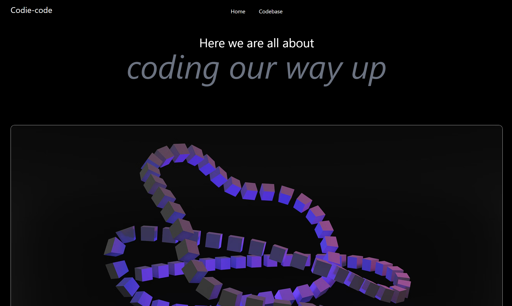

# Codie Code

Welcome to Codie Code! This is a simple and efficient web application for coding and programming enthusiasts.

## Features
- **Code Editor**: Write and test your code in a sleek and user-friendly code editor.
- **Run Code**: Execute your code directly within the browser.
- **Improvements Incoming**: I am working on this repo to make it a DSA solving platform and many updates are on their way soon.

## Demo
Check out the live demo [here](https://prrrrnav.github.io/codie-code/).

## Screenshots
### Home Page

### Editor Page

## Getting Started
To run the application locally, follow these steps:
1. Clone this repository.
2. Navigate to the project directory.
3. Open `index.html` in your web browser.

## Contributing
Contributions are welcome! Feel free to submit bug reports, feature requests, or pull requests to help improve Codie Code.

